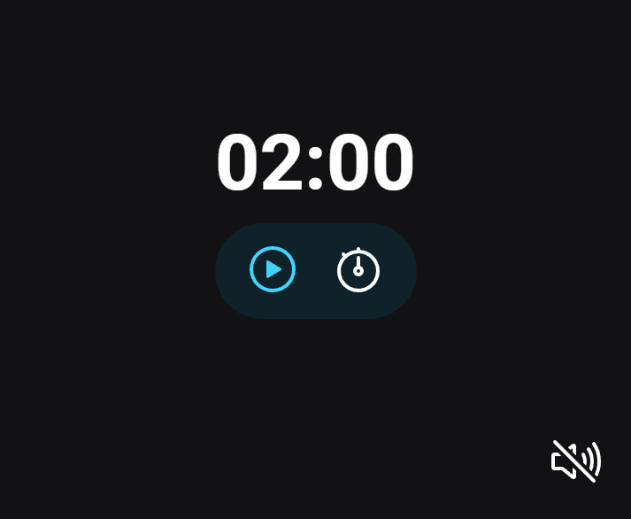
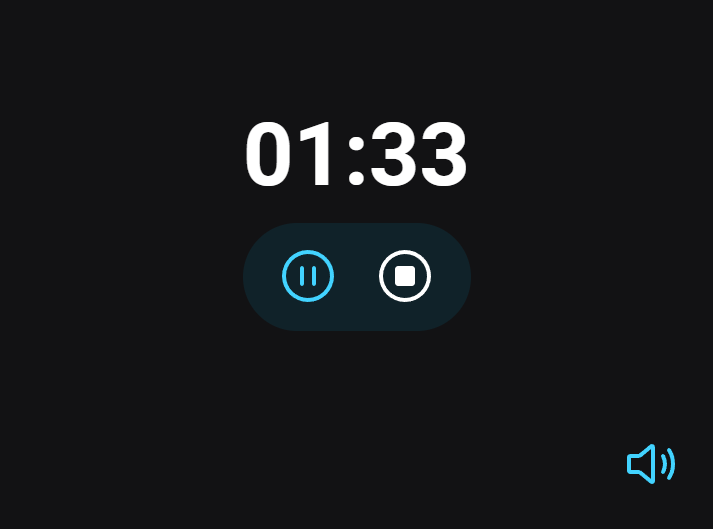

# TIMER

## An alarm clock that can be timed by the user.

> The project aimed to use DOM and ES Modules (EcmaScript 6 - ES6) to build an alarm clock that can have its time programmed by the user.
> I also worked on inserting audio into the application and reinforced my knowledge of HTML, CSS, JavaScript, DOM, node, events, code refactoring and separating JS into modules.

🔗 [Click here to access](https://matheusborgesdev.github.io/Timer/)

## 💻 Technologies

- HTML
- CSS
- JavaScript
- ECMAScript 6
- DOM
- Git & Github
- Figma

## 📧 Contact

matheusb.dev@gmail.com
